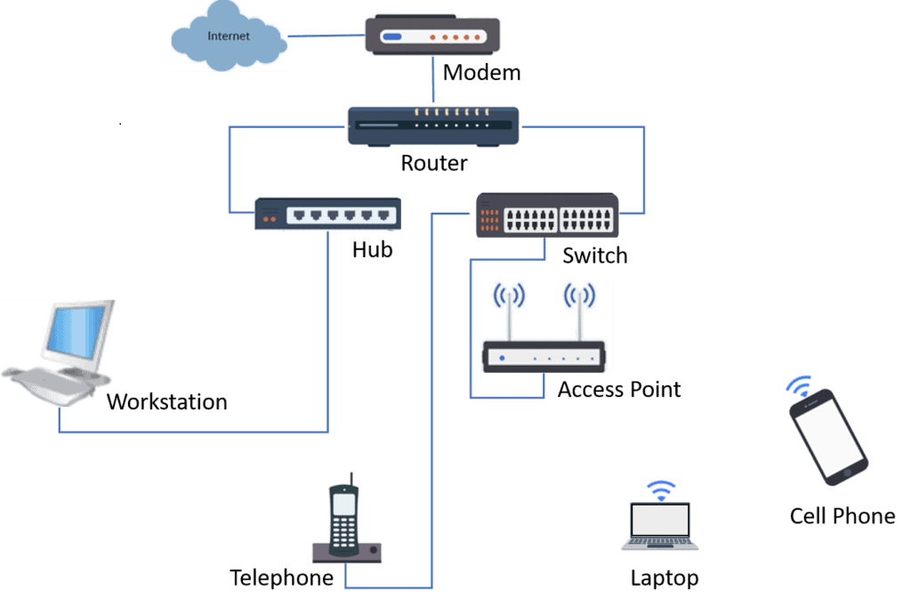
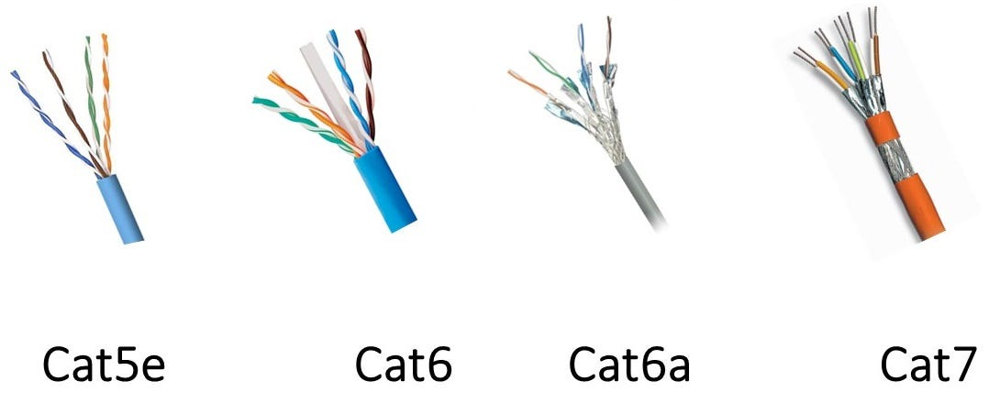

# **Lab 0: Overview of Computer Network Basics & Making Ethernet Cables**  

## **Objective:**  
- Understand basic networking concepts.  
- Learn how to create Ethernet cables (Straight-Through & Crossover).  
- Get familiar with networking tools.  

## **Required Equipment:**  
- **Mikrotik hAP ac lite router**  
- **PC or Laptop**  
- **GNS3 installed on the system**  
- **RJ45 Connectors**  
- **Cat5e/Cat6 Ethernet Cables**  
- **Crimping Tool**  
- **Cable Tester**  
- **Wire Stripper**  

## **Step 1: Basic Networking Overview**  
1. **What is a Network?** - Explain networks, nodes, and interconnections. 

A network is a collection of interconnected devices (nodes) that can communicate and share resources. These interconnections can be wired (e.g., Ethernet cables) or wireless (e.g., Wi-Fi).
--- 
2. **Types of Networks** - LAN, WAN, MAN, PAN. 
- **Personal Area Network (PAN)**

    Scope: A small network used by one person, typically connecting devices within a range of a few meters.   

   Characteristics: Low cost, easy to set up, uses wireless technologies like Bluetooth.  
   Example: Connecting a smartphone to wireless headphones or a smartwatch.   
   
- **Local Area Network (LAN)**

   Scope: Connects devices within a limited area, such as a home, office, or school.   

   Characteristics: High speed, low cost, easy to set up.
   Example: Home Wi-Fi network with a router connecting computers, smartphones, and printers.
   

- **Metropolitan Area Network (MAN)**

   Scope: Larger than a LAN but smaller than a WAN, typically covering a city or metropolitan area.   

   Characteristics: Higher speed and lower cost than WANs, used to connect multiple LANs.  
   Example: A city-wide network connecting government offices, businesses, and schools.
   

- **Wide Area Network (WAN)**

   Scope: Spans a large geographical area, often connecting multiple LANs.   

   Characteristics: Lower speed than LANs, higher cost, complex setup.  
   Example: The Internet, connecting networks across the globe. 
   

3. **Networking Devices** - Router, Switch, Hub, Access Point.
   
-   **Router**: Forwards data packets between different networks.
-   **Switch**: Connects devices within a LAN and forwards data only to the intended recipient. 
-   **Hub**: Connects devices within a LAN, but broadcasts all data to all connected devices. (Note: Hubs are largely outdated.)
-   **Access Point**: Allows wireless devices to connect to a network.
4. **IP Addressing Basics** - IPv4, IPv6, Subnetting. 
- **IPv4**: Uses 32-bit addresses, represented in dotted decimal notation (e.g., 192.168.1.1). 
   
-  **IPv6**: Uses 128-bit addresses, represented in hexadecimal notation (e.g., 2001:0db8:85a3:0000:0000:8a2e:0370:7334). 
   
-  **Subnetting**: Dividing a network into smaller subnetworks to improve efficiency and security. 
   

## **Step 2: Understanding Ethernet Cables**  
1. **Types of Ethernet Cables**  
   
   - **Cat5e**: Supports speeds up to 1 Gbps. 
   - **Cat6**: Supports speeds up to 10 Gbps at shorter distances and has better shielding than Cat5e. 
   - **Cat6a**: Supports speeds up to 10 Gbps over longer distances and has even better shielding than Cat6. 
   
     
2. **Straight-Through vs. Crossover Cables**  
   
      - **Straight-Through**: Used to connect devices of different types (e.g., computer to switch, router to switch). (Image illustrating straight-through connection)
      - **Crossover**: Used to connect devices of the same type (e.g., computer to computer, switch to switch). (Image illustrating crossover connection) (Note: Modern devices often auto-sense and adjust, making crossover cables less necessary.)
- **Standard T568A and T568B Wiring**: These standards define the order of the wires within the RJ45 connector. 
   

## **Step 3: Making Ethernet Cables**  
### **A. Cutting & Stripping the Cable**  
1. Take a **Cat5e/Cat6 cable** and cut it to the required length.  
   
2. Use a **wire stripper** to remove about **1.5 inches of the outer sheath**.  
   
3. Untwist the pairs and straighten them out.  
   
### **B. Arranging Wires According to Standards**  
1. **For Straight-Through Cable:**  
   - Follow **T568B** on both ends.  
   - Wire order: **Orange-White, Orange, Green-White, Blue, Blue-White, Green, Brown-White, Brown**.  

2. **For Crossover Cable:**  
   - One end follows **T568A**, the other follows **T568B**.  
   - T568A: **Green-White, Green, Orange-White, Blue, Blue-White, Orange, Brown-White, Brown**.  
   - T568B: **Orange-White, Orange, Green-White, Blue, Blue-White, Green, Brown-White, Brown**.  

### **C. Crimping the Connectors**  
1. Insert wires into the **RJ45 connector** in order.  
2. Push them firmly inside until they reach the end.
     
3. Use a **crimping tool** to crimp the RJ45 connector.  
   
### **D. Testing the Cable**  
1. Use a **cable tester** to check continuity and proper wiring.  
2. If a cable fails the test, redo the crimping process.  
   
## **Step 4: Connecting Devices to the Network**  
1. Use the **Ethernet cable** to connect a **PC** to a **router or switch**.  
2. Verify the link using **LED indicators** on the network interface.  

## **Conclusion:**  
- You have successfully created an Ethernet cable.  
- You understand the basic concepts of networking.  
- You are ready to move to **Lab 1: Creating a Basic LAN Network**.  

---