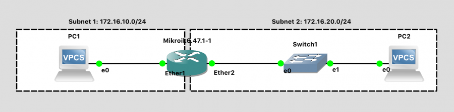
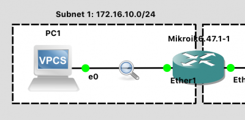

# **Lab 2: Dive into RouterOS**  

## **Objective:**  
In this lab, you will configure a simple network using GNS3 on your computer and learn more about RouterOS. 

## Configure Network
In GNS3, create a network topology that matches this one:

Lab 2 Network Diagram (Note: Subnet labels and dashed borders are for informational use only)

This network should meet the following specifications:

### Subnet 1

    CIDR address notation for subnet: 172.16.10.0/24
    Contains one VPC with IP address 172.16.10.1
    Contains the "Ether1" port of the Router with IP address 172.16.10.254

### Subnet 2

    CIDR address notation for subnet: 172.16.20.0/24
    Contains one VPC with IP address 172.16.20.1
    Contains the "Ether2" port of the Router with IP address 172.16.20.254
    Contains one Ethernet Switch

### To accomplish this:

1. Create a “New Blank Project” and call it lab02.
2. Drag two “VPCS” (Virtual PCs) onto the blank network diagram from the panel at left. If prompted to "Choose a server", select "GNS3 VM".
3. Drag a “Mikrotik 6.x” router onto the network diagram from the panel at left.
4. Drag an "Ethernet Switch" onto the network diagram from the panel at left.
5. Using the “Add a link” button on the left panel, wire up the network using virtual Ethernet cables. Make your network look like the network above.
    - Note: The PCs only have 1 interface, so you can’t connect the wire to the wrong port there
    - Note: For a generic switch, the ports don't matter - The switch will automatically learn the location of connected devices.
    - Note: The Router has 4 interfaces. The ports you plug your network wires into must be consistent with the way you configure your router in software. For now, just carefully match the diagram. In future labs, when you’re more comfortable, you can make port decisions on your own.
    - Note: Wondering why your diagram doesn’t show port labels? Press the “Show/Hide Interface Labels” button. Button: Show/Hide Interface Labels
6. Press the Start button to launch your two virtual PCs, router, and switch. All the links should turn from RED to GREEN.
7. Press the Console Connect to All Nodes Button: Console Connect button to pull up a terminal to both PCs and the Router devices. (You could right-click on each and choose Console as well, but we need to configure all three). The simple switch provided by GNS3 does not have a console.

### At the MikroTik console:

1. Note: We are configuring the router first, because we can’t configure the PC network fully until the default gateway (the router) exists.
2. Enter the default MikroTik login of admin with a blank password.
3. Select N when prompted to view the license file.
4. Enter "Safe Mode" via CTRL-X, as a good habit while experimenting with configuration
5. Configure two interfaces (corresponding to the two wires plugged in)
    5.1 ip address add address=172.16.10.254/24 interface=ether1
    5.2 ip address add address=172.16.20.254/24 interface=ether2
6. Print the configuration to confirm: ip address print
7. Give your router a hostname to identify it in larger networks:
    7.1 Check the current router name: system identity print
    7.2 Set a new router name: system identity set name=WHATEVER-YOU-WANT
    7.3 Check the current router name: system identity print

### At the PC1 console:

1. Show the help menu for available command (recall that this is a rudimentary simulated PC): help
2. Configure an IP address: ip 172.16.10.1/24 172.16.10.254
    1. This sets up a subnet of 172.16.10.0/24, assigns the PC the IP address 172.16.10.1, with a default gateway of 172.16.10.254 (which is the router)
3. Show the configuration: show ip
4. Save the configuration to persist after power cycling: save

### At the PC2 console:

1. Configure an IP address: ip 172.16.20.1/24 172.16.20.254
    1. This sets up a subnet of 172.16.20.0/24, assigns the PC the IP address 172.16.20.1, with a default gateway of 172.16.20.254 (which is the router)
2. Show the configuration: show ip
3. Save the configuration to persist after power cycling: save

### Finally, demonstrate the network is functional:

1. Go to the PC1 console
2. Ping the router's Ether1 interface, which PC1 is directly connected to: ping 172.16.10.254. You should see something to the effect of 84 bytes from 172.16.10.254 icmp_seq=1 ttl=63 time=2.699 ms indicating that the router is responding to PC1. Press CTRL-C to stop pinging.
3. Ping the router's Ether2 interface, which is on the "other side" (so to speak...) of the router: ping 172.16.20.254. This should succeed.
4. Ping PC2 through the router: ping 172.16.20.1. This should succeed.

Back at the router, exit Safe Mode via CTRL-X when you're happy with your router configuration. This will save the configuration. 

### Exercise 1

1. Press ?. What Happens?
2. Type system clock ?. What is the output?
3. Using the response for system clock ?, set the current date and time. What commands did you use? Use system clock print to verify your success.
4. Type interface ethernet print. What is the value of your ether1 interface?
    1. MAC (hardware) address (in hex)
    2. MTU

## Wireshark
Let's use one more feature of GNS3 in this lab - the ability to capture packets on any wire and send them to Wireshark for analysis.

First, if you don't have Wireshark installed in your native OS (i.e. Windows or Mac), go and install it now: http://wireshark.org/

Now, to begin packet capture and analysis, right-click on the link between PC1 and the router (the wire should highlight briefly in red), and choose "Start Capture". Accept the default file name where the captured packets are saved, and ensure that "Start the capture visualization program" is checked. A magnifying glass should appear signifying that the link is being inspected. GNS3 will begin dumping packets from the simulated network to a .pcap file on disk, and launch Wireshark to display the contents of that file. Unlike in previous class activities where we used Wireshark as a sniffer, here GNS3 is the "sniffer" (of the simulated network), and Wireshark is just being used for post-analysis and display.

Let the capture run while you initiate a ping from PC1 to PC2. When you're finished capturing, right-click on the link again and choose "Stop Capture".

### Exercise 2

1. How can you determine which ping packets are leaving PC1, and which are arriving at PC1?
2. Using Wireshark, find an ICMP "Echo (ping) request" message. What is the source MAC address of that packet? Then, using the PC1 terminal, use show ip. What is the MAC address of the PC1 interface?
3. Using Wireshark, find an ICMP "Echo (ping) response" message. What is the source MAC address of that packet? Then, using the Router terminal, use interface ethernet print. What is the MAC address of the "ether1" interface?
4. Does a ping request or response packet utilize the typical TCP or UDP transport layer?
5. What other packets / protocols were being sent over the network while this trace was obtained?
6. Explain in your own words: What is a subnet? We had two of them in today's lab.

Another neat feature of GNS3 that we may explore in a future lab is "Packet Filters". With these, you can ask GNS3 to degrade the link in some way: Dropping packets, delaying them, or corrupting them at random. It's a useful way to test how the software protocols respond in such scenarios. 

