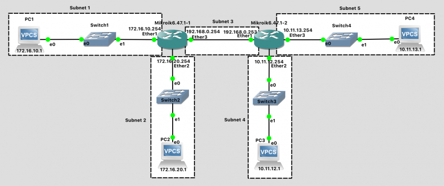
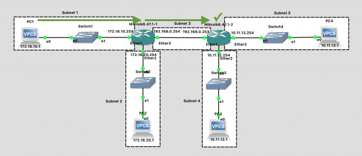
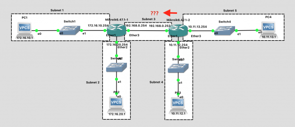
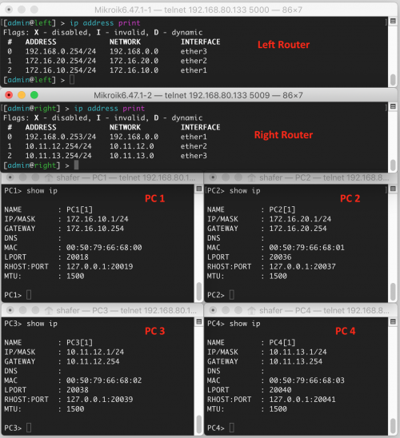

# **Lab 3: Static Routing**  
### **Objective:**  
In this lab, you will configure subnets and static routes in a larger network topology. 
---

## **1. Overview of Static Routing**  
### **What is Static Routing?**  
Static routing is a **manual routing method** where the network administrator defines specific paths for network traffic using **static routes**.  

### **Why Use Static Routing?**  
- **Predictability**: The network administrator controls the route selection.  
- **Security**: No automatic updates, reducing the risk of incorrect routes.  
- **Efficiency**: Ideal for small networks with few route changes.  

---
## **3. Lab Setup and Instructions Using GNS3 Simulator**
### Create Network
In GNS3, create a network topology that matches this one:



Network Diagram (Note: Subnet labels and dashed borders are for informational use only)

This network should meet the following specifications:

There are two routers with hostnames left and right as viewed on the network diagram.

### Subnet 1 - 172.16.10.0/24

    Contains one Ethernet Switch
    Contains VPC1 with IP address 172.16.10.1
    Contains the "Ether1" port of the "left" Router with IP address 172.16.10.254

### Subnet 2 - 172.16.20.0/24

    Contains one Ethernet Switch
    Contains VPC2 with IP address 172.16.20.1
    Contains the "Ether2" port of the "left" Router with IP address 172.16.20.254

### Subnet 3 - 192.168.0.0/24

   Contains the "Ether3" port of the "left" Router with IP address 192.168.0.254
   Contains the "Ether1" port of the "right" Router with IP address 192.168.0.253

### Subnet 4 - 10.11.12.0/24

    Contains one Ethernet Switch
    Contains VPC3 with IP address 10.11.12.1
    Contains the "Ether2" port of the "right" Router with IP address 10.11.12.254

### Subnet 5 - 10.11.13.0/24

    Contains one Ethernet Switch
    Contains VPC4 with IP address 10.11.13.1
    Contains the "Ether3" port of the "right" Router with IP address 10.11.13.254

Unlike in previous labs, here you are responsible for determining the correct commands to use when configuring your network devices. Refer to the previous labs if you need a refresher on how to configure IP addresses and hostnames for the routers and VPCs.

### Tips:

    The process goes more smoothly if you configure the routers first, and then the PCs in each subnet.
    The specific port on a switch does not matter (until we get to a point in the semester where we are configuring switches)
    The specific port on a router does matter. The router configuration in software needs to be consistent with the way the cables are wired in hardware.

### Configuration Steps:
1. Configure the hostnames of the "left" and "right" routers to prevent confusion. Use the system identity set name=XXX command. Notice that the command prompt changes to reflect this. You should see [admin@left] > instead of [admin@MikroTik] >

2. Configure IP addresses on all router interfaces that are connected to subnets. Use the ip address add address=a.b.c.d/n interface=XXX command.

3. Configure the IP address on each VPC. Use the ip a.b.c.d/n w.x.y.z command. When determining the correct "ip" command to use, ask yourself:

   3.1 What is the IP address I want the machine to have?

   3.2 What is the subnet that IP address is in?

   3.3 What is the IP address of the default gateway? The default gateway is the router that the VPC should send packets to when tryingto communicate outside the subnet. Because routers have multiple IP addresses, you should choose the IP address of the interface thatis within the subnet in question.

   3.4 Save the configuration on the VPCs via the save command and exit safe mode on the router.

When finished, your left router should be configured like this:

```
[admin@left] > ip address print               
Flags: X - disabled, I - invalid, D - dynamic 
 #   ADDRESS            NETWORK         INTERFACE                              
 0   192.168.0.254/24   192.168.0.0     ether3                                 
 1   172.16.20.254/24   172.16.20.0     ether2                                 
 2   172.16.10.254/24   172.16.10.0     ether1           
 ```

And your right router should be configured like this:

```
[admin@right] > ip address print 
Flags: X - disabled, I - invalid, D - dynamic 
 #   ADDRESS            NETWORK         INTERFACE                              
 0   192.168.0.253/24   192.168.0.0     ether1                                 
 1   10.11.12.254/24    10.11.12.0      ether2                                 
 2   10.11.13.254/24    10.11.13.0      ether3  
```

And PC1 (as an example) should be configured like this:

 PC1> show ip
```
NAME        : PC1[1]
IP/MASK     : 172.16.10.1/24
GATEWAY     : 172.16.10.254
DNS         : 
MAC         : 00:50:79:66:68:00
LPORT       : 20018
RHOST:PORT  : 127.0.0.1:20019
MTU:        : 1500
```

### Test Network

How do we know if the network is working? Let's test it, but in a very systematic way, to ensure all the pieces are functional.

First, check to see that each individual host has its own IP address and subnet configured as desired, and has connectivity. Do this by pinging a neighbor in the same subnet.
1. From the left router, ping the right router (192.168.0.253). They are on the same subnet. This should work.
2. From the left router, ping PC1 (172.16.10.1) through the switch. They are on the same subnet. This should work.
3. From the left router, ping PC2 (172.16.20.1) through the switch. They are on the same subnet. This should work.
4. From the right router, ping PC3 (10.11.12.1) through the switch. They are on the same subnet. This should work.
5. From the right router, ping PC4 (10.11.13.1) through the switch. They are on the same subnet. This should work.

Next, let's check if we can send messages **between** subnets.
1. From PC1, ping PC2 (172.16.20.1) through the switch, router, and switch. This should work.
2. From PC1, ping the ether1 port of the right router (192.168.0.253). This should NOT work.

Wait, why does this not work?? Everything is wired up! Stupid computers... 


Let's think about what happens when the ping request message is sent:

1. PC1 wants to send a ping request message to the "right" router - 192.168.0.253.
2. PC1 determines that this destination is outside the local subnet
3. PC1 forwards the message to the "left" router
4. The "left" router determines that the destination is on a local subnet, subnet 3, and is directly attached
5. The "left" router forwards the message to the destination. Success!



While the ping request is successfully received, the ping reply immediately runs into difficulties.

1. The "right" router wants to send a ping reply message to PC1 - 172.16.10.1.
2. The "right" router determines that the destination is not on any directly attached subnets
3. The "right" router never transmits the ping reply because it doesn't know where to send it. Failure!



What is needed is a way to tell each router about subnets that are not directly connected, but instead are further away. This is accomplished in the routing table.

Routing tables tell routers where to send packets whose destination network is not directly attached to the router. Routing table entires can be static or dynamic. Today, we look at static routes, which are entered manually. In a future lab we'll look at protocols that a router can use to create a routing table dynamically. 

### Create Static Routes

On each router, you need to create static entries in the routing table specifying how to reach any subnets that are not directly connected to the router. (It learned about directly attached subnets when you configured the interfaces).

The syntax for this is: ip route add dst-address=a.b.c.d/n gateway=w.x.y.z. That specifies the subnet to be reached (a.b.c.d/n)and the IP of the next-hop router (w.x.y.z) which will move the packet closer to its destination. Note that this is the "next-hop" router - there may be others routers between here and the destination, but only the next hop is being entered in this particular routing table.

For the left router:
```
# Examine existing routing table with the entries created by the interfaces
ip route print  

# Add new entries specifying how to reach distant subnets by way of the "right" router
# To reach subnet 4, the next hop is the "right" router:
ip route add dst-address=10.11.12.0/24 gateway=192.168.0.253
# To reach subnet 5, the next hop is the "right" router:
ip route add dst-address=10.11.13.0/24 gateway=192.168.0.253
```
When finished, the routing table for the left router should look like this:
```
[admin@left] > ip route print
Flags: X - disabled, A - active, D - dynamic, 
C - connect, S - static, r - rip, b - bgp, o - ospf, m - mme, 
B - blackhole, U - unreachable, P - prohibit 
 #      DST-ADDRESS        PREF-SRC        GATEWAY            DISTANCE
 0 A S  10.11.12.0/24                      192.168.0.253             1
 1 A S  10.11.13.0/24                      192.168.0.253             1
 2 ADC  172.16.10.0/24     172.16.10.254   ether1                    0
 3 ADC  172.16.20.0/24     172.16.20.254   ether2                    0
 4 ADC  192.168.0.0/24     192.168.0.254   ether3                    0
 ```
 

After adding those two static routing table entries for the left router, switch to the right router and add two similar rules for its routing table.
### Test Network (Again)

    From PC1, ping the ether1 port of the right router (192.168.0.253). This should work.
    From PC1, ping PC3 (10.11.12.1). This should work.
    From PC1, ping PC4 (10.11.13.1). This should work.

### Troubleshooting

Having trouble getting your network pings to work when they should? Before asking for assistance, verify that the IP addresses of all the PCs and routers in your network are correctly configured. Example output from a working lab network is shown below.

