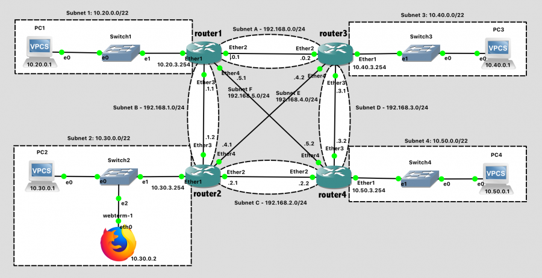
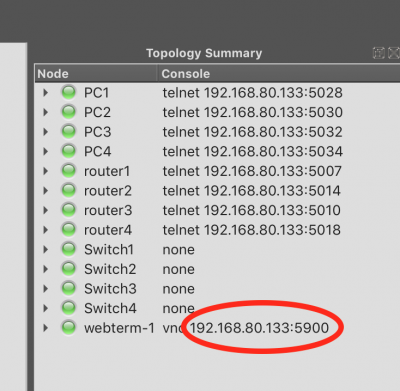
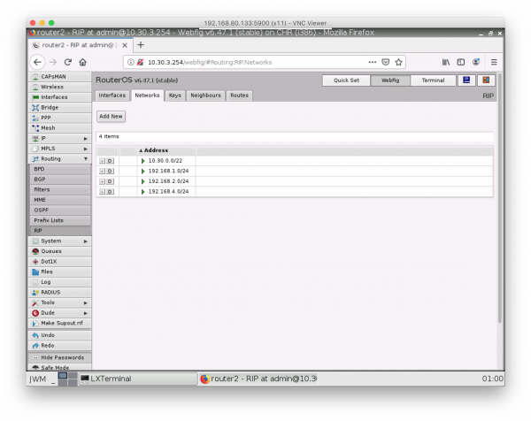

# Lab 4 - Dynamic Routing

## Table of contents:
- Import Webterm Appliance
- Create Network
- Test Network
- Routing Information Protocol (RIP)
- Create Dynamic Routes
- Webterm (Traceroute)
- Link Failure
- Webterm (RouterOS GUI)
- Lab Submission

In this lab, you will use dynamic routing to simplify network setup and automatically react to link failures.

## Import Webterm Appliance

GNS3 has the ability to import "appliances" - pre-packed machine images - to easily gain access to additional functionality in your simulated network. Today we're going to add the "Webterm" appliance to your network. Webterm contains the Firefox web browser plus a number of useful networking utilities: net-tools, iproute2, ping, traceroute, iperf3, ssh client, tcpdump and the multicast testing tools msend/mreceive.

Reference: [Import GNS3 Appliance](https://docs.gns3.com/docs/using-gns3/beginners/import-gns3-appliance/)

To access these features:

1. Go to the [Webterm marketplace](https://gns3.com/marketplace/appliances/webterm) page and select the download button

1. Open GNS3 and select File->Import Appliance

1. Choose the file you just downloaded: webterm.gns3a

1. Choose "Install the appliance on the GNS3 VM (recommended)"

1. Choose Finish


Note that all you have added here is a template for the Webterm feature. When you actually add it to a network (next), GNS3 will automatically download and install all of the supporting files to enable this feature.

## Create Network

In GNS3, create a network topology that matches this one:



Network Diagram (Note: Subnet labels and dashed borders are for informational use only)

This network should meet the following specifications:

There are four routers with hostnames `router1`, `router2`, `router3`, and `router4` as viewed on the network diagram.
Note that subnets 1-4 are `/22` subnets, not `/24`. This is intentional - these are larger subnets that have 1024 addresses instead of 256.

### Subnet 1 - 10.20.0.0/22
    - VPC1 IP: 10.20.0.1
    - Router1 IP: 10.20.3.254

### Subnet 2 - 10.30.0.0/22

    - VPC2 IP: 10.30.0.1
    - Webterm IP: 10.30.0.2
    - Router2 IP: 10.30.3.254

### Subnet 3 - 10.40.0.0/22

    - VPC3 IP: 10.40.0.1
    - Router3 IP: 10.40.3.254

### Subnet 4 - 10.50.0.0/22

    - VPC4 IP: 10.50.0.1
    - Router4 IP: 10.50.3.254

### Subnet A - 192.168.0.0/24

    - Router1 IP: 192.168.0.1
    - Router3 IP: 192.168.0.2

### Subnet B - 192.168.1.0/24
    - Router1 IP: 192.168.1.1
    - Router2 IP: 192.168.1.2

### Subnet C - 192.168.2.0/24
    - Router2 IP: 192.168.2.1
    - Router4 IP: 192.168.2.2

### Subnet D - 192.168.3.0/24
    - Router3 IP: 192.168.3.1
    - Router4 IP: 192.168.3.2

### Subnet E - 192.168.4.0/24
    - Router2 IP: 192.168.4.1
    - Router3 IP: 192.168.4.2

### Subnet F - 192.168.5.0/24
    - Router1 IP: 192.168.5.1
    - Router4 IP: 192.168.5.2

### Tips:

    - The process goes more smoothly if you configure the routers first, and then the PCs in each subnet.
    - The specific port on a switch does not matter (until we get to a point in the semester where we are configuring switches)
    - The specific port on a router does matter. The router configuration in software needs to be consistent with the way the cables are wired in hardware.

### Configuration Steps:

  1. Configure the hostnames of routers 1-4 in GNS3 to prevent confusion. Use the GUI in GNS3 (right-click, choose "Change Hostname") to change how it looks on the network diagram.
  1. Configure the hostnames of routers 1-4 in the router itself to prevent confusion. Use the system identity set name=XXX command to change the hostname on the router itself. Notice that the command prompt changes to reflect this. You should see [admin@router1] > instead of [admin@MikroTik] >
  1. Configure IP addresses on all router interfaces that are connected to subnets. Use the ip address add address=a.b.c.d/n interface=XXX command.
  1. Configure the IP address on each VPC. Use the ip a.b.c.d/n w.x.y.z command.
  1. Save the configuration on the VPCs via the save command and exit safe mode on the router.

### Webterm Configuration

The webterm module is a tiny Linux computer running some bare-bones Debian software. As such, its network will need to be configured as well.

  1. Right-click on the Firefox icon in the network map and choose "Configure"
  1. Under "Network Configuration", click "Edit"
  1. What you see here is a generic Debian network configuration file. You can ignore the existing commented-out lines, and add this to the bottom.
  ```
    auto eth0
    iface eth0 inet static
    address 10.30.0.2
    netmask 255.255.252.0
    gateway 10.30.3.254
  ```
  4. Click "Save" and "OK" to exit out of the configuration.

### Test Network

Before adding in the dynamic routing element, let's first test that each PC and the associated router are configured correctly by running a ping test between each. These should all work.

  1. From PC1, ping Router1 (10.20.3.254).
  1. From PC2, ping Router2 (10.30.3.254).
  1. From PC2, ping Webterm (10.30.0.2).
  1. From PC3, ping Router3 (10.40.3.254).
  1. From PC4, ping Router4 (10.50.3.254).
  1. From Router1, ping Router2 (192.168.1.2).
  1. From Router1, ping Router3 (192.168.0.2).
  1. From Router1, ping Router4 (192.168.5.2).
  1. From Router4, ping Router2 (192.168.2.1).
  1. From Router4, ping Router3 (192.168.3.1).

Just to confirm your knowledge of routing tables, have PC1 try to ping PC4 (10.50.0.1). This should not work, and in fact Router1 should return an ICMP "Destination network unreachable" error message that is visible in the ping program:

```
PC1> ping 10.50.0.1
*10.20.3.254 icmp_seq=1 ttl=64 time=0.670 ms (ICMP type:3, code:0, Destination network unreachable)
```

Remember that routing tables tell routers where to send packets whose destination network is not directly attached to the router. Routing table entries can be static or dynamic. Today, we look at dynamic routes, which are created by a dynamic routing protocol that is run on all of the routers simultaneously.

## Routing Information Protocol (RIP)

The Routing Information Protocol (RIP) is one of the earliest Internet routing protocols and is still in widespread use today, facilitating dynamic routing. RIP is a distance-vector (DV) protocol. In DV protocols, neighboring routers exchange distance vectors with each other. The distance vector for any one router is the current estimate of the shortest path distances from that router to subnets within the network. RIP uses the term hop, which is the number of subnets traversed along the shortest path from source router to destination subnet, including the destination subnet.

In RIP, routing updates are exchanged between neighbors periodically using a RIP response message. The response message sent by a router or host contains a list of up to 25 destination subnets within the network, as well as the sender’s distance to each of those subnets. Response messages are known as RIP advertisements.

A router may update its routing table and the distance to a subnet upon receiving an RIP advertisement from a neighboring router. This happens if the current estimate of the shortest path distance from that router to a given subnet is larger than the distance through the neighboring router that has advertised its own shortest path. In other words, the router has now located a shorter path! When this happens, RIP modifies the local routing table and then propagates this information by sending advertisements to its neighboring routers (the ones that are still reachable). A router can also request information about its neighbor’s cost to a given destination using RIP’s request message. Routers send RIP request and response messages to each other over UDP using port number 520.

## Create Dynamic Routes

RIP should be enabled on all routers within the Lab 4 network. To enable RIP on router1, follow this process:

```bash
# Tell RIP to advertise the routers to connected subnets (and neighboring routers)
routing rip set redistribute-connected=yes

# Tell RIP to run more frequently
# (Our network is tiny, so the overhead of frequent updates is minimal)
routing rip set update-timer=15s
routing rip set timeout-timer=30s
routing rip set garbage-timer=30s

# Run RIP on all interfaces
# (Note: we're being lazy here.  The interfaces going to the PCs do NOT need RIP run on them. Only the routers need it)
routing rip interface add interface=all send=v2 receive=v2

# Tell RIP about subnets directly connected to your router
routing rip network add network=10.20.0.0/22
routing rip network add network=192.168.0.0/24
routing rip network add network=192.168.1.0/24
routing rip network add network=192.168.5.0/24

# Confirm you entered the correct networks
routing rip network print

# View routes that RIP has discovered
routing rip route print
```

```bash
Follow this process and enable RIP on routers 2, 3, and 4
```

After RIP is enabled on routers 2-4, examine the RIP routes on router1. There should be one to every subnet on the network:

```bash
[admin@router1] > routing rip route print 
Flags: C - connect, S - static, R - rip, O - ospf, B - bgp 
 #   DST-ADDRESS        GATEWAY         FROM                METRIC
 0 R 10.20.0.0/22                                                1
 1 R 10.30.0.0/22                       192.168.1.2              2
 2 R 10.40.0.0/22                       192.168.0.2              2
 3 R 10.50.0.0/22                       192.168.5.2              2
 4 R 192.168.0.0/24                                              1
 5 R 192.168.1.0/24                                              1
 6 R 192.168.2.0/24                     192.168.1.2              2
 7 R 192.168.3.0/24                     192.168.0.2              2
 8 R 192.168.4.0/24                     192.168.1.2              2
 9 R 192.168.5.0/24                                              1
 ```

    When RIP is enabled on routers 2-4, PC1 should be able to ping PC2, PC3, and PC4.

    Document your GNS3 topology and these successful pings with screenshot(s).
    Document the output of routing rip route print on Router3 with a screenshot.

## Webterm (Traceroute)

To examine the network further, let's run the traceroute program on Webterm.

First, connect to Webterm. If you're lucky, right-clicking on the Firefox icon and choosing "Console" will pop up a VNC virtual desktop connection to Webterm.

Finding VNC IP and port




Once in Webterm, click on the "JWM" button at the bottom right and launch the "Terminal" program. Perform a traceroute to PC3, showing the hops taken to reach that destination.
```
# traceroute 10.40.0.1
traceroute to 10.40.0.1 (10.40.0.1), 30 hops max, 60 byte packets
 1  10.30.3.254 (10.30.3.254)  4.242 ms  5.106 ms  5.306 ms
 2  192.168.4.2 (192.168.4.2)  12.862 ms  13.863 ms  14.094 ms
 3  10.40.0.1 (10.40.0.1)  19.718 ms  21.102 ms  22.357 ms
```

## Link Failure

Let's simulate some link failures now, and watch our routing protocol react!

  1. Record the results of the traceroute showing the path from webterm to PC3 (Result 1 - No link failure)
  1. "Suspend" the link (Right-click on the link) between Router2 and Router3, which tells GNS3 to drop all packets on that link
  1. Wait until pings to PC3 succeed again (~30 seconds)
  1. Record the results of the traceroute showing the path from webterm to PC3 (Result 2 - 1 link failure)
    "Suspend" the links between Router1 and Router2, and Router3 and Router4.
  1. Wait until pings to PC3 succeed again (~30 seconds)
  1. Record the results of the traceroute showing the path from webterm to PC3 (Result 3 - 3 link failures)
  1. "Resume" all 3 links again
  1. Record the results of the traceroute showing the path from webterm to PC3 (Result 4 - No link failure)
    1. If you're QUICK about it, you might catch it in the process of updating the routes and optimizing the path each time you run traceroute.

    Document these results in a textfile
## Webterm (RouterOS GUI)

Your RouterOS routers also have a web interface as an alternative to the command-line. In Webterm, launch Firefox (JWM -> Applications -> Mozilla Firefox) and navigate to `http://10.30.3.254` or the IP of any router. When the page loads, switch to the "WebFig" panel up top. While the GUI may not pretty, it is a faithful equivalent to the command line interface in every way, and may be easier to navigate if you are "just browsing" to see what features this capable software router supports.

RouterOS Web Interface


  Document this result with a screenshot

### Lab Submission

Submit the following items to the Lab 4 Canvas assignment:

For the original network (with no link failures), provide screenshot(s) showing:

  1. Your GNS3 topology
  1. Successful pings from PC1 to PC2
  1. Successful pings from PC1 to PC3
  1. Successful pings from PC1 to PC4
  1. The output of `routing rip route print` on Router3

Provide the traceroute results (plain text is fine) for

  1. Result 1 - No link failure
  1. Result 2 - 1 link failure
  1. Result 3 - 3 link failures
  1. Result 4 - No link failure

Screenshot of the RouterOS web interface (in WebFig view) for any router.

When finished, press the Stop button and exit GNS3. The GNS3 VM (in VMware) should halt and exit automatically. 