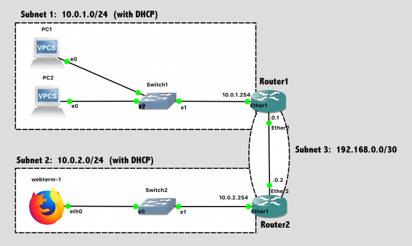

# Dynamic Host Configuration Protocol (DHCP)
In this lab, you'll configure the Dynamic Host Configuration Protocol (DHCP) on the routers so that hosts can request their own IP addresses automatically.

## Design Network

Your network topology should match this design:



   Network Diagram (Note: Subnet labels and dashed borders are for informational use only)
## Implementation

### Tips:

- The process goes more smoothly if you configure the routers first, and then the PCs in each subnet.
- The specific port on a switch does not matter (until we get to a point in the semester where we are configuring switches)
- The specific port on a router does matter. The router configuration in software needs to be consistent with the way the cables are wired in hardware.

### Configuration Steps:

   1. Configure the **hostnames** of the routers in GNS3 to prevent confusion (via the GUI).
   1. Configure the **hostnames** of the routers in the router itself to prevent confusion (via the CLI).
   1. Configure **IP addresses** on all router interfaces that are connected to subnets.
   1. Disable the DHCP Client on each router. (Unless you ran Wireshark on a link, you wouldn't have previously noticed that a new MikroTik router defaults to running a DHCP client on Ether1, trying to auto-configure that network port so a new administrator can access the router over the network. It's not helpful for us here.) `ip dhcp-client print` followed by `ip dhcp-client remove numbers=0` will eliminate this.
   1. Configure **dynamic routing (RIP)** between subnets 1, 2, and 3. After configuration, verify with `/ip route print` that the route table is as you desire.
      1. Don’t be lazy this time and run RIP on “all” interfaces. Only run RIP on the interfaces between Router1 and Router2.
      1. `routing rip interface add interface=etherX send=v2 receive=v2 # For the interface going to other routers`
      1. `routing rip interface add interface=etherY passive=yes # For the interface going to clients`
   1. Configure the **DHCP server** on both routers to provide addresses to their directly connected subnet.
      1. Router1 should provide addresses to Subnet1
      1. Router2 should provide addresses to Subnet2
   1. Enable the **DHCP client** on the VPCs and the Webterm client.
   1. Save the configuration on the VPCs via the `save` command and exit safe mode on the router.

## Dynamic Host Configuration Protocol (DHCP)
### For Routers

On the MikroTik routers, a DHCP Server can be easily enabled. The following commands configure Router 1 (as shown above) to provide DHCP services to Subnet 1.

First, create a DHCP Pool with a range of IP addresses that the router should give to clients. You'll want to exclude addresses that are used by the router itself or any other statically-configured network devices in that subnet.

```bash
ip pool add name=pool1 ranges=10.0.1.1-10.0.1.253
ip pool print
```

Second, enable a DHCP server on a specific interface, using a specific pool of IP addresses, and offering IP address "leases" for a specified time period. Set `disabled=no` to enable this server.

```bash
ip dhcp-server add interface=ether1 address-pool=pool1 lease-time=24h name=dhcp1 disabled=no
ip dhcp-server print
```

Finally, configure DHCP to communicate the subnet information, desired DNS servers, and default gateway to clients. Just use Google Public DNS here (8.8.8.8 and 8.8.4.4), despite this network not being connected to the Internet yet.

```bash
ip dhcp-server network add address=10.0.1.0/24 dns-server=8.8.8.8,8.8.4.4 gateway=10.0.1.254
ip dhcp-server network print
```
After configuring clients (see below), you can check on the router to see which IP addresses have been assigned to which clients.

```bash
ip dhcp-server lease print
```

For this Lab , you'll want to configure Router 1 to provide addresses for Subnet 1, and Router 2 to provide addresses for Subnet 2.

### For Clients

In the GNS3 VPCS, you can enable DHCP at the command line:
```bash
ip dhcp      # Request IP address via DHCP
show ip      # See what address you were assigned
save         # Save the configuration
```

   - Tip 1: If you make a mistake, clear ip will reset the VPCS network.
   - TIp 2: If you shut down and re-launch your network, the VPCS will boot more quickly than the routers, attempt DHCP immediately, and fail. You can always re-run ip dhcp to tell the simulated PC to "try it again". In a real computer, this is less of an issue, as DHCP will keep trying repeatedly.

In the GNS3 Webterm, you can enable DHCP via the unit preferences. Right-click on the module in the network map, select "Configure", and then select "Edit" in the network configuration area. Uncomment the following lines, which represents the contents of the file /etc/network/interfaces, a common Linux config file to specify network settings.

```
auto eth0
iface eth0 inet dhcp
```

Once the Webterm is booted and accessible over VNC, you can launch a terminal on it and find the assigned IP address via `ifconfig` or `ip addr`, the two usual Linux commands for finding information about network interfaces.

## Test Network

For testing, ensure that PC1 can successfully ping PC2 and and Webterm-1.

## Lab Submission

Submit the following items to the Lab 6 Canvas assignment:

   - Provide a screenshot showing your GNS3 topology
   - Provide a screenshot showing successful pings from PC1 to PC2 and Webterm
   - Provide a screenshot with the Router1 web console (via VNC on webterm-1) showing DHCP Leases. (Go under WebFig->IP->DHCP Server->Leases)
   - Provide a screenshot showing the output of `/ip route print` on Router2
   - Provide a Wireshark .pcapng file showing the 4 "DORA" (Discovery, Offer, Request, and Acknowledgement) packets from DHCP for one of the VPCS systems. You may need to do a `clear ip` and `ip dhcp` on a VPCS to trigger a DHCP conversation while you are doing packet capture. Filter your Wireshark packet list to only include DHCP (via `bootp.option.type == 53`), mark those packets, and export only the marked packets to a new file for submission. Your submitted file should only contain 4 packets, no more! (and no less)
      - Tip: If you want to capture some packets from within the simulated GNS3 network, how do you do that?
   - Provide a Wireshark .pcapng file showing what a RIPv2 "Response" broadcast looks like on the link between Router1 and Router2. Filter your Wireshark packet list to only include RIP (via rip), mark a few of the endless list of identical broadcasts, and export only the marked packets to a new file for submission.
