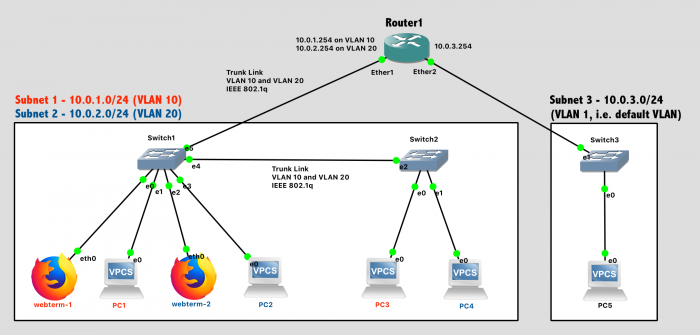
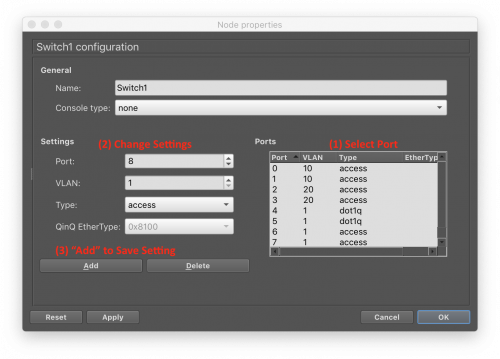

# Virtual Local Area Networks (VLANs)

In this lab, you'll configure VLANs on the switches and router to provide for network isolation between sets of hosts on the same physical network. 

## Design Network

Your network topology should match this design:

  Network Diagram (Note: Subnet labels and dashed borders are for informational use only)

### Subnet 1: 10.0.1.0/24, VLAN 10

    Webterm-1, connected to Port 0 of Switch1 (access type)
    PC1, connected to Port 1 of Switch1 (access type)
    PC3, connected to Port 0 of Switch2 (access type)

### Subnet 2: 10.0.2.0/24, VLAN 20

    Webterm-2, connected to Port 2 of Switch1 (access type)
    PC2, connected to Port 3 of Switch1 (access type)
    PC4, connected to Port 1 of Switch2 (access type)

### Subnet 3: 10.0.3.0/24, VLAN 1 (default VLAN)
     PC5

### Additional Requirements

  - Router1 will provide DHCP services to all 3 subnets
  - The link between Switch1 and Switch2 will use 802.1q VLAN Tagging and carry traffic for multiple VLANs
  - The link between Switch1 and Router1 will use 802.1q VLAN Tagging and carry traffic for multiple VLANs

## VLAN Overview

VLANs allow traffic for multiple Virtual LANs to be carried over the same physical LAN in an isolated fashion. Or, to phrase it another way, each VLAN is its own independent broadcast domain. Typically, VLANs are configured by the network administrator on data link layer devices such as switches and routers, not hosts such as PCs. (The only exception might be a datacenter server with a specific need to be on multiple VLANs simultaneously). VLAN settings must be configured on a port-by-port basis, and include two key pieces of information:

1. The VLAN ID Number (0-4095), which is used by data link layer devices to distinguish between VLANs. The default VLAN ID is 1.
2. The port type
    1. **Access type:** The port carries traffic for a single VLAN only, and the connected device does not see any VLAN headers at all. This is used for ports connected to hosts.
    2. **Trunk type:** The port carries traffic for multiple VLANs over a single link. In this case of 802.1q, one level of VLAN tags can be carried, or in the case of q-in-q, a VLAN can be encapsulated inside another VLAN. This is used for ports connected to switches or routers.

## VLAN Configuration on GNS3 Switches

GNS3 has some "quirks" when it comes to configuring VLANs on the built-in switches. It requires the VLAN ID number and VLAN type (access, 802.1q trunking, or q-in-q ) for a port to be set before a link is connected to the port. This is not a normal requirement. In a real switch, you could change the VLAN setting at any time. But, in the simulator, the VLAN should be configured before the network is wired.

Right-click on the switch and choose Configure. Then, in this specific order, you should:

  1. Select a specific port
  1. Change that port setting (VLAN ID, Type)
  1. "Save" the setting by clicking the "Add" button
  1. Repeat for all the ports you wish to change
  1. Choose "OK" to exit the configuration window

For ports that are connected to hosts (the VPCS), ensure their VLAN ID is set correctly and leave the port type set to "Access".

For ports that carry traffic for multiple VLANs, leave the VLAN ID set as 1 (default) but change the port type to "dot1q", for the IEEE 802.1q VLAN tagging standard.

## VLAN Configuration on Mikrotik Router

Configuring VLANs on the router is very straightforward. Each VLAN appears as a separate interface to the router and can be used in much the same way as all the physical interfaces (ether1, ether2, etc...).

Add virtual interfaces to the router corresponding to the desired VLAN IDs. By specifying the physical interface, 802.1q trunking will be used:

interface vlan add name=vlan10 vlan-id=10 interface=ether1 disabled=no
interface vlan add name=vlan20 vlan-id=20 interface=ether1 disabled=no

We don't need nested VLANs in this lab, but if you wanted q-in-q nested VLANs, you could accomplish that by simply adding a new VLAN (with ID number) and specifying its interface as another VLAN virtual interface.

To verify your setup:

  1. Print out the VLAN interfaces: `interface vlan print`
  1. Print out all the interfaces (physical and virtual): `interface print`

**At this point, you can use interfaces "vlan10" and "vlan20" as normal interfaces.** They can be assigned IP addresses, used in routing tables, and wherever else interfaces may be needed. The router will ensure that data sent over those VLAN interfaces is tagged with the correct VLAN ID number.
## Implementation

Tips:

  - The process goes more smoothly if you configure the routers first, and then the PCs in each subnet.
  - The specific port on a switch does matter in this lab, because we are assigning different ports to different VLANs.
  - The specific port on a router does matter. The router configuration in software needs to be consistent with the way the cables are wired in hardware.

## Configuration Steps:

  1. Configure the **VLAN settings** in Switch1 and Switch2 (this is done first due to GNS3 limitations)
  1. Configure the **hostname** of the router in GNS3 to prevent confusion (via the GUI).
  1. Configure the **hostname** of the router in the router itself to prevent confusion (via the CLI).
  1. Configure **IP addresses** on all router interfaces that are connected to subnets. Remember that some IP addresses should be on the VLAN virtual interfaces!
  1. Disable the **DHCP Client** on the router that runs automatically for new system setup. `ip dhcp-client print` followed by `ip dhcp-client remove numbers=0` to remove it.
  1. Configure the **DHCP server** on the router to provide addresses to all 3 subnets. Remember that some DHCP services should be on the VLAN virtual interfaces!
  1. Enable the **DHCP client** on the VPCs and the Webterms.
  1. Save the configuration on the VPCs via the `save` command and exit safe mode on the router.

## Test Network

For testing, first ensure that PC1 can successfully ping all other devices on the network.

Simple ping testing, however, is not sufficient to demonstrate that VLANs are correctly configured and that the broadcast domains are isolated between them. To test your VLANs, send out broadcast packets and see where they are received.

  1. Start packet capture on the following links and keep them all running at the same time. Don't get your Wireshark windows mixed up! (The title bar tells you what link is being shown...)
      1. Link between PC1 and Switch1 (in VLAN 10)
      1. Link between PC2 and Switch1 (in VLAN 20)
      1. Link between PC3 and Switch2 (in VLAN 10)
      1. Link between PC4 and Switch2 (in VLAN 20)
  2. On Webterm-1, try pinging an IP address in its subnet (e.g. 10.0.1.1) that is not assigned to any current host. (Tip: Close Firefox first, since it will be trying and failing to connect to the Internet in the background).
     1. What kind of packet will Webterm-1 try repeatedly to send until you CTRL-C to cancel the ping attempts?
     1. Where in the network would you expect to see that packet? (i.e. how far does that broadcast domain extend?)
     1. Can you confirm that in Wireshark?
  3.  On Webterm-2, try pinging an IP address in its subnet (e.g. 10.0.2.1) that is not assigned to any current host, and repeat the verification process.

## Lab Submission

Submit the following items:

  - Provide a **screenshot** showing your GNS3 topology and the configuration panel for Switch1 with the VLAN-specific settings present
  - Provide a **screenshot** showing successful pings from PC1 to Webterm-2 and PC5
  - Provide a **text answe**r: How can pinging a non-existent IP within a subnet be used to verify VLAN configuration? What kind of packet is sent? Where is such a packet expected to go, and to not go?
  - Provide a **screenshot** showing ip address print on your router. Some IP addresses should be assigned to VLAN interfaces and others to physical interfaces.
  - Provide a **screenshot** showing ip route print on your router. Some routes should go out of VLAN interfaces and others go out physical interfaces.
  - Provide a **screenshot** showing ip dhcp-server print detail on your router. Some DHCP servers should be assigned to VLAN interfaces and others to physical interfaces.
  - Provide a **Wireshark .pcapng file** from the link between Switch1 and Router1 while Webterm1 is actively pinging Webterm2. Filter your Wireshark packet list so that the only packets shown are for a single ICMP echo request (from Webterm1) and the corresponding ICMP echo reply (from Webterm2) via icmp.ident==XX && icmp.seq==YY. Mark those packets, and export only the marked packets to a new file for submission. Given your knowledge of VLANs and the way a packet will travel between different VLANs, how many packets should be in this capture?
